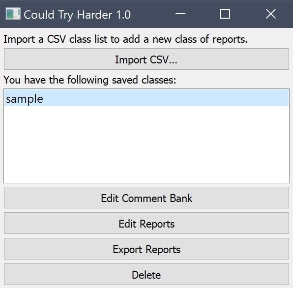
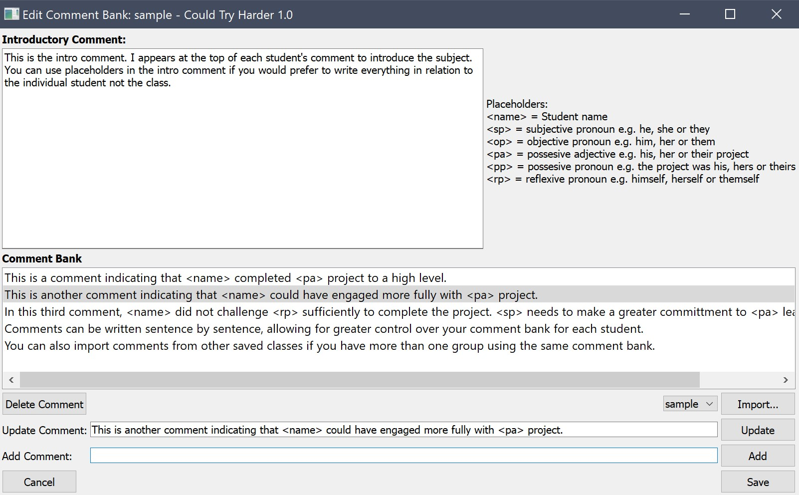
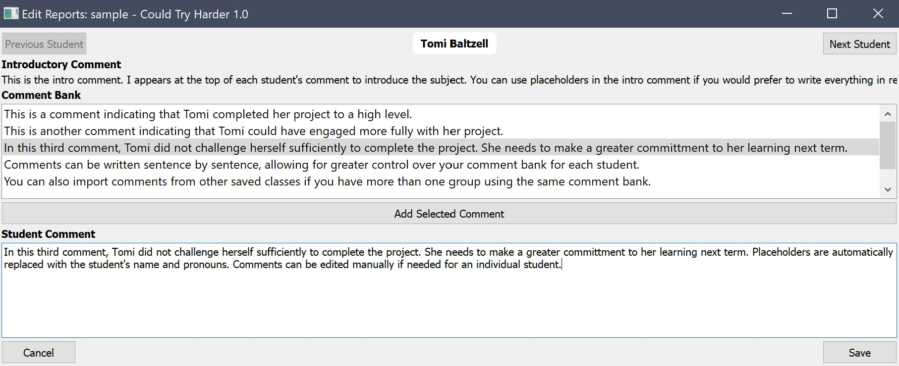

# Could Try Harder

Simple report comment builder for teachers.

## Introduction

*Could Try Harder* lets you build your comment bank sentence by sentence,
automatically replacing names and pronouns correctly for each student. It allows
you to specify style guide rules for simple replacements (e.g. replacing "Exam"
with "Examination") and outputs a plain text file with each student's comment,
ready to enter into your SMS.

*Could Try Harder* takes a csv file of student names and genders. See
instructions below for how to get set up.

*Could Try Harder* is written in Python using QT. It is free and open source.

## Screenshots

## Getting Started

You will need the following installed:

- Python (version 3 or higher)
- pip

### Download or Clone

Download or clone the repository into a location of your
choice.

### Install Python Modules

Open a terminal (or command prompt on Windows), navigate to your newly
downloaded folder.

Install the required Python modules:

`pip install -r requirements.txt`

You will also need to download some data for the TextBlob module (which does
some of the grammar magic):

`python -m textblob.download_corpora`

Then run the app by double-clicking on *app.py* or typing:
`python app.py`

### Preparing Class Lists

*Could Try Harder* can import a class list of students from a csv file. Your csv
file should have no column headings, and should have the following columns:

1. First Name e.g. "Samantha"
2. Last Name e.g. "O'Brien"
3. Gender: either "Male" or "Female" (see note below on how to deal with
   gender-neutral pronouns)

### Changing Style Rules

Style rule definitions can be found in config.py. They are python tuples
representing a regular expression string and it's replacement. The tuples are
passed to python's re.sub() method with the case-insensitive flag.

## Known Issues

Things that *Could Try Harder* does not yet do (but hopefully will soon):

- Spell-checking
- Gender Neutral Pronouns (see below for a workaround)
- GUI for editing individual student's pronouns
- GUI for editing style rules
- Ability to export only the comment bank from a subject for use in future

### Gender Neutral Pronouns

The ability to have gender neutral pronouns is planned for the next version. For
the time being, each student's pronouns can be customised by opening the .json
file for the class located in the *data* folder. Use a text editor to manually
change the pronouns for the relevant students. The pronouns in this file are (in
order):

1. Subjective Pronoun: e.g. "he or she or they"
2. Objective Pronoun: e.g. "him or her or them"
3. Possessive Adjective: e.g. "his, her or their project"
4. Possessive Pronoun: e.g. "the project was his, hers or theirs"
5. Reflexive Pronoun: e.g. "himself, herself or themself"

### Strange Characters before First Student Name

If you are seeing unexpected text characters at the beginning of your first
student's name on the *Edit Reports* window, then it is likely you have
imported a csv file with the wrong encoding. This usually happens when using
Excel. To prevent it, be sure to save your csv file using the "Comma
Separated File CSV" format from Excel and not use any of the formats that
mention "UTF-8" or "Mac" or "Windows".
